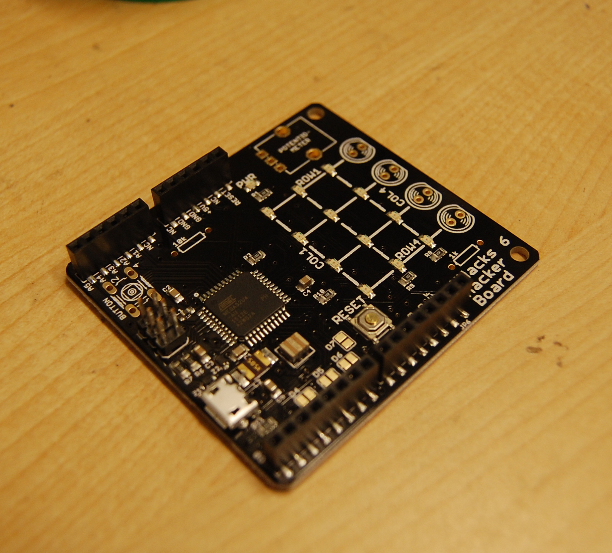

MHacks Six Hacker Boards
============
This repository contains the support files for the MHacks 6 Hacker Boards, presented at the Intro to Hardware Workshop ([presentation can be found here](https://docs.google.com/presentation/d/15O3TXqOf3Xi9S6ba83HRF5j0ccdkGcIPRQTYAptkbrs/edit#slide=id.gdf724c5d4_0_47)). In the hardware folder is copies of the Eagle schematic and board layout for the board given to participants, and in the firmware folder is the library to simplify working with the board's LEDs, button, and potentiometer/knob - also called "peripherals".

The MHacks Six Hacker Board. You like it? You should have come to the MHacks Six Intro to Hardware Workshop!

###How to Install the Library
* Inside of the Arduino IDE, go to Sketch->Import Library->Add Library.
* Choose the *HackerBoard* folder inside of the firmware folder.
* The Arduino IDE handles the rest!
* Be sure to check out the example animation (File->Examples->HackerBoard) if you're unsure how to work with the library, or what to do!